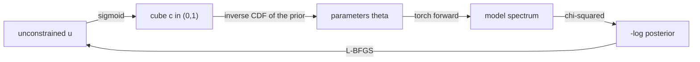

# Differentiability report

TauREx3 now has a PyTorch implementation of the transmission forward model, and
a retrieval that follows its gradient instead of sampling the posterior blind.

## What was added

`src/taurex/differentiability/`

| file | contents |
| --- | --- |
| `physics.py` | torch ports of the hydrostatic profile, the path-length matrix, the opacity interpolation and the boxcar smoothing |
| `model.py` | `Atmosphere`: the differentiable transmission model, the contribution plans, a linear binning operator and the log likelihood |
| `optimizer.py` | `LaplaceOptimizer`: a maximum a posteriori fit followed by a Laplace approximation of the posterior |
| `__init__.py` | exports, and the module the plugin entry point points at |

The numpy model is untouched and remains the reference implementation. The
torch code reads the same object graph the input file builds, so profiles,
gases, contributions, priors and bounds all come from taurex as before; only the
arithmetic is re-expressed in torch.

`pyproject.toml` gained a `differentiable` extra that installs torch, and a
plugin entry point that registers the optimizer. Run

```console
$ pip install -e . --no-deps
```

once so the entry point is registered.

## Usage

One line changes in the input file:

```ini
[Optimizer]
optimizer = laplace
```

`torch`, `torch_laplace` and `differentiable` are accepted as aliases. The
fitting parameters, bounds, modes and priors are read exactly as before, and the
HDF5 output keeps its usual layout, because the optimizer implements the same
sampler interface (`get_solution`, `get_samples`, `get_weights`) the other
optimizers use.

## How the optimizer works

Nested sampling has no gradient to follow, so it has to *explore* the posterior
and burn thousands of likelihood evaluations doing it. A differentiable model
lets the fit *locate* the posterior instead: follow the gradient to the mode,
then describe the shape around it. `LaplaceOptimizer` does exactly that, in five
steps.



### 1. Parameters are reparameterised to live inside their priors

Each fitted parameter gets one unconstrained coordinate `u`. It is mapped to a
cube coordinate `c = sigmoid(u)` in `(0, 1)`, and `c` is then mapped to the
parameter by the inverse cumulative distribution of that parameter's own prior,
which is the same map `Optimizer.prior_transform` uses in the sampling
optimizers.

This means the bounds and priors from the input file are respected *by
construction*. No penalty terms, no clipping, no rejected proposals: every point
the optimizer visits is a physically allowed one, and a parameter can never
wander outside its bounds. For a `log` mode parameter the fit space is already
`log10`, so a `LogUniform` bound simply becomes a flat interval in that space.

The optimizer starts from whatever values the input file holds, by inverting the
same map at those values.

### 2. The objective is the posterior over the parameters

The quantity minimised is

```
-log posterior(u) = -log likelihood(theta(u)) - sum_i log prior_i(theta_i(u))
```

with `theta = parameters_of(u)` as above. The prior enters as a density **over
the parameters themselves**, not over `u`. That distinction matters: if the
objective were written as the density of `u`, the sigmoid's Jacobian would tilt
it and the reported mode would drift away from the chi-squared minimum. Written
this way, a flat prior contributes only an additive constant — so it is dropped
— and the mode is exactly the maximum-likelihood point, while a `Gaussian` prior
contributes its quadratic and genuinely pulls the fit.

### 3. The mode is found with L-BFGS

`torch.optim.LBFGS` with a strong-Wolfe line search. It is quasi-Newton, so it
builds a curvature estimate from successive gradients and converges in far fewer
steps than a gradient-free search. Every objective evaluation is one forward
plus one backward pass of the whole atmosphere; the line search may need a
handful of those per step.

If no parameter is enabled under `[Fitting]` the fit raises rather than
returning the starting point unchanged.

### 4. The Hessian at the mode becomes the covariance

`torch.autograd.functional.hessian` differentiates the objective a second time at
the optimum, giving `H`. The Laplace approximation says the posterior near the
mode is roughly Gaussian with covariance `H^-1`. The Hessian is taken in `u`
rather than in parameter space because `u` is well conditioned — the sigmoid
saturation that makes parameters awkward is exactly what keeps `u` of order one
— and the result is then pushed back to parameter space with the Jacobian of the
transformation, so the reported covariance is the covariance of the *parameters*.

Retrieval Hessians are numerically nasty: they routinely span many orders of
magnitude across their eigenvalues, and the near-null directions are what make a
plain inversion fail. Two safeguards handle this.

- The Hessian is divided by its largest entry first, which bounds the matrix.
- A ridge is then added, sized so the scaled matrix is strictly diagonally
  dominant. By Gershgorin's theorem that makes it positive definite whatever
  numerical noise did to its spectrum, so the factorisation cannot fail.

The ridge is not only a numerical device. It also caps the variance of
directions the data does not constrain, which is what makes an unconstrained
parameter come back prior dominated rather than infinite. Directions with real
curvature sit orders of magnitude above the ridge and are untouched.

### 5. Samples, medians and error bars come from that Gaussian

`num_samples` draws are taken in `u` space from the fitted Gaussian and pushed
through the *same* prior transform, so every sample lands inside the prior
support however wide the Gaussian is. The samples carry equal weight, because
they are already draws from the posterior rather than links of a correlated
chain — which is also why `sigma_fraction` can be set far lower here than for a
sampling optimizer.

The median of those draws, the per-parameter standard deviations, and the
profile error bands all follow from them through the base optimizer's normal
post-processing.

### Options

| option | default | meaning |
| --- | --- | --- |
| `num_samples` | 2000 | posterior draws taken from the Gaussian |
| `max_iterations` | 200 | maximum L-BFGS steps |
| `max_lbfgs_iterations` | 40 | line search evaluations allowed per step |
| `gradient_tolerance` | 1e-10 | convergence tolerance on the gradient norm |
| `eigenvalue_floor` | 1e-3 | ridge on the scaled Hessian; larger values widen the error bars of unconstrained parameters |
| `seed` | 0 | seed for the draws, so a run is reproducible |
| `device` | cpu | torch device |
| `sigma_fraction` | 0.02 | fraction of the draws reused for the profile bands |

### What it gives up

There is no Bayesian evidence, so this optimizer cannot compare models the way
`multinest` can — the Laplace estimate of `Z` is only as good as the Gaussian
assumption and is deliberately not reported. The uncertainties are likewise only
trustworthy where the posterior is roughly Gaussian. In the Gaussian limit the
MAP and the marginal errors agree with what nested sampling would return; where
the posterior is strongly curved, multimodal or bounded, use a sampling
optimizer.

## Correctness

The torch model is not an approximation of the numpy one. On the example
retrieval (80 layers, 4669 native points, 488 observation bins):

| quantity | agreement with the numpy model |
| --- | --- |
| transit depth | `6.6e-16` maximum relative difference |
| binned spectrum | `8.8e-16` maximum relative difference |
| log likelihood | `-93014.79951309151` against numpy `-93014.79951309128` |

Autograd gradients of the chi-squared match central finite differences to `1e-8`
or better, so the optimizer is following the derivative of the same quantity the
numpy model evaluates. The Laplace Hessian was checked against finite
differences independently and agrees to eight significant figures.

`tests/differentiability/` holds 18 tests covering forward-model parity, the
binning operator, gradient accuracy, prior handling, parameter recovery on
synthetic data, and the errors raised for unsupported setups. The 321
pre-existing tests still pass.

## Measured cost

Single evaluation of the example model:

| | time |
| --- | --- |
| numpy forward | 40 ms |
| torch forward | 36 ms |
| torch forward + backward | 60 ms |

The per-evaluation cost is comparable; the gain is that the gradient comes almost
free. One gradient costs about 1.5 forwards, where a central-difference gradient
needs `2n` forwards — eight for the four-parameter example.

Whole fit, four parameters, MAP plus 2000 posterior samples:

| | |
| --- | --- |
| numpy forwards that fit is worth | 36 |
| wall clock | 1.4 s |

Nested sampling at 302 live points needs of order `10^4` to `10^5` evaluations
for the same problem, which at 40 ms each is 40 minutes to several hours, so the
fit is roughly three to four orders of magnitude cheaper. The full
`taurex -i par.par -o out.hdf5 --retrieval` run takes 50 s end to end, of which
4.5 s is the fit; the remainder is post-processing, which still goes through the
numpy model on the full native grid and is the natural next thing to port.

## Limitations

- Cross-section opacities only. `opacity_method = ktables` raises a clear
  `NotImplementedError` rather than silently falling back.
- Temperature profiles `Isothermal` and `NPoint`, `ConstantGas` mixing, and the
  `Absorption`, `Rayleigh`, `CIA` and `FlatMie` contributions. Anything else
  fails with the class name in the message.
- The prior must be one of `Uniform`, `LogUniform`, `Gaussian` or `LogGaussian`.
- Binning is supported for `FluxBinner` and `NativeBinner`, which is what
  `BaseSpectrum.create_binner` returns. The `spectra_w_offsets` observation used
  by the complex example lives in a plugin that is not part of this repository,
  so its offset parameters are untested here.
- The uncertainties are a Laplace approximation, so they are only trustworthy
  where the posterior is roughly Gaussian. Directions the data does not
  constrain come back prior dominated instead of well measured.
