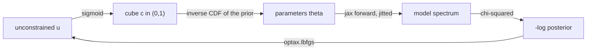

# Differentiability report: JAX

This is the JAX successor of the PyTorch implementation documented in
`differentiability_report.md`. The torch code and its dependency are gone from
this branch; the differentiable forward model, the gradient-based retrieval
(Laplace or NUTS) and the plugin entry point are the same package,
`taurex.differentiability`, with JAX underneath. Everything an input file had
to say about the fit is unchanged.

|               | torch branch                        | this branch                             |
| ------------- | ----------------------------------- | --------------------------------------- |
| forward model | eager `torch` tensors               | traced and compiled `jax` programs      |
| mode finder   | `torch.optim.LBFGS` (strong Wolfe)  | `optax.lbfgs` (strong Wolfe zoom)       |
| Hessian       | `torch.autograd.functional.hessian` | `jax.hessian`, forward-over-reverse     |
| precision     | `float64` tensors                   | `float64` via `jax_enable_x64`          |
| dependency    | `torch`                             | `jax` + `optax` (+ `blackjax` for NUTS) |

## What is in the package

`src/taurex/differentiability/`

| file           | contents                                                                                                                                                                                |
| -------------- | --------------------------------------------------------------------------------------------------------------------------------------------------------------------------------------- |
| `physics.py`   | JAX ports of the hydrostatic profile, the path-length matrix, the opacity interpolation and the boxcar smoothing                                                                        |
| `model.py`     | `Atmosphere`: the differentiable transmission model, the contribution plans, a linear binning operator and the log likelihood                                                           |
| `optimizer.py` | `LaplaceOptimizer`: a maximum a posteriori fit followed by a Laplace approximation of the posterior, plus an optional NUTS sampler, multi-start, a fitted jitter and Fisher diagnostics |
| `__init__.py`  | exports, the 64 bit switch, and the module the plugin entry point points at                                                                                                             |

The numpy model is untouched and remains the reference implementation. The JAX
code reads the same object graph the input file builds, so profiles, gases,
contributions, priors and bounds all come from taurex as before; only the
arithmetic is re-expressed in JAX.

`pyproject.toml` gained a `differentiable` extra that installs `jax`, `optax`
and `blackjax`, and a plugin entry point that registers the optimizer and its
aliases. Run

```console
$ pip install -e . --no-deps
$ pip install -e .[differentiable]
```

once so the entry point is registered and the three dependencies are present.
JAX is installed in its CPU form by default; `jax[cuda]` in its place is enough
to move the whole fit to a GPU, because nothing in the port is CPU specific.

## Differences from the original TauREx3

This branch is additive with respect to the original
[`ucl-exoplanets/TauREx3`](https://github.com/ucl-exoplanets/TauREx3). No
existing TauREx module is edited: everything outside the new package is a
handful of lines added to `pyproject.toml`. The numpy forward model, the
chemistry, the contributions, the priors, the sampling optimizers, the command
line and the HDF5 output are the originals and keep working exactly as before,
so a parfile written for the original still runs. The torch implementation in
`differentiability_report.md` belongs to a sibling prototype branch and was
never part of the original either.

### At a glance

|                        | original TauREx3                                      | this branch                                                                         |
| ---------------------- | ----------------------------------------------------- | ----------------------------------------------------------------------------------- |
| forward model          | numpy, eager, CPU                                     | the same object graph re-expressed in JAX; traced, JIT-compiled, CPU or GPU         |
| retrieval              | nested sampling (`multinest`, `polychord`, `nestle`)  | gradient maximum a posteriori (`optax.lbfgs`) plus a Laplace approximation, or NUTS |
| posterior              | explored blindly, thousands of likelihood evaluations | located from its gradient, then described or sampled                                |
| evidence               | yes, from the nested samplers                         | no, not implemented yet                                                             |
| uncertainties          | from the sampled chains                               | from the Hessian (Laplace) or from the NUTS draws                                   |
| cost of one likelihood | one numpy forward pass                                | one compiled forward pass; a gradient is a few forwards                             |
| extra diagnostics      | none                                                  | covariance, Fisher information, jitter, timing counters                             |
| precision              | float64 numpy                                         | float64 JAX (`jax_enable_x64`)                                                      |

### New code and packaging

- A new package, `src/taurex/differentiability/`, with `physics.py` (the JAX
  ports of the hydrostatic profile, path matrix, opacity interpolation and
  smoothing), `model.py` (`Atmosphere`, the differentiable transmission model),
  `optimizer.py` (`LaplaceOptimizer`) and `__init__.py`.
- A new optional extra, `differentiable = ["jax", "optax", "blackjax"]`, and a
  new entry point, `[tool.poetry.plugins."taurex.plugins"] differentiability = "taurex.differentiability"`, which is what lets the factory discover the
  optimizer from `optimizer = laplace` (aliases `jax`, `jax_laplace`,
  `differentiable`).
- New tests under `tests/differentiability/`, the benchmark
  `examples/differentiability/benchmark.py`, `test_run/parfile_complex.par`,
  and the two design reports. No new console script and no change to the output
  format.

### Retrieval behaviour

- The original draws from a unit cube. This branch optimises an unconstrained
  vector `u`, maps it through a sigmoid to a cube and then through the
  parameter's own prior inverse CDF, so the same priors and bounds are honoured
  by construction, without penalty terms.
- The likelihood is the same quantity, written so it can be differentiated; the
  original convention (`-sum log sigma sqrt(2pi) - chi2/2`) is kept.
- New retrieval choices: `sampler = laplace` (Gaussian from the Hessian) or
  `sampler = nuts` (exact draws), `n_starts` restarts, and an optional fitted
  `jitter` that inflates the errors by `sqrt(error^2 + jitter^2)`. The original
  offers sampling only.
- There is no evidence, so model comparison is not available from this
  optimizer; the nested samplers remain the way to get `Z`.
- The `[Fitting]` block, priors, bounds and modes are read exactly as in the
  original.

### Model coverage

The differentiable model implements a subset and raises `NotImplementedError`
outside it, leaving the original numpy path for everything else:

- temperature: `Isothermal` and `NPoint`;
- chemistry: `TaurexChemistry` with `ConstantGas` gases;
- contributions: `Absorption`, `Rayleigh`, `CIA` and `FlatMie`;
- opacities: cross-section (`xsec`) tables only, not `ktables`;
- binning: `FluxBinner` and `NativeBinner`.

### Post-processing, diagnostics and parallelism

- Profile and spectrum uncertainties are computed with one `jax.vmap`-ed call
  instead of the original per-sample numpy loop.
- Under MPI the original partitions the post-processing across ranks; the JAX
  path evaluates the same draws on every rank, which is correct but duplicated.
  The sampling optimizers keep their MPI behaviour.
- New outputs that an original input file does not produce: the parameter
  covariance, `fisher_information()`, the fitted jitter, and the
  `compile_time` / `fit_time` / `laplace_time` / `iterations` /
  `function_evaluations` / `gradient_evaluations` counters.

### Compatibility

- Input files, fitting parameters, priors, bounds and the HDF5 layout are
  unchanged, and the new optimizer implements the same sampler interface
  (`get_solution`, `get_samples`, `get_weights`).
- The differences a downstream consumer should expect are the absence of an
  evidence value and, with `sampler = nuts`, a covariance that is the sample
  covariance rather than the Laplace one.

## Usage

The input file does not change at all:

```ini
[Optimizer]
optimizer = laplace
```

`jax`, `jax_laplace` and `differentiable` are accepted as aliases. The fitting
parameters, bounds, modes and priors are read exactly as before, and the HDF5
output keeps its usual layout, because the optimizer implements the same
sampler interface (`get_solution`, `get_samples`, `get_weights`) the other
optimizers use.

## What is different from the torch port

The physics is a line by line port, but four choices had to change to be
traceable and fast, and they are the interesting part of doing this in JAX.

**Everything the model reads is static, so it is compiled once.** The pressure
grid, the resampled opacity tables and the binning matrix are closed over by
the objective; the first time it is traced they become constants of the
compiled program, and no array is moved to the device again for the rest of the
fit. The observed spectrum is different: it is a traced argument of the
likelihood rather than a constant, which is what lets a jittered error bar or a
second dataset reuse a compiled program. The optimizer still captures the
observation it was built with, so a fit is compiled per `compute_fit` call.

**The hydrostatic recursion is a `lax.scan`.** The layer thickness at each
boundary depends on the scale height below it, so the numpy code walks the
layers in a python loop. Under JIT that would unroll `nlayers` copies of the
step into the graph; the scan compiles it to a loop instead.

**The flat cloud deck selects its layers with a mask, not a slice.** The numpy
and torch code pick the layer window with `searchsorted` on concrete pressure
values and then slice. A slice needs python integers, which a traced cloud top
is not, so the window is built with traced `searchsorted` bounds and applied
with `jnp.where`. That is what lets a fitted cloud deck keep its gradient _and_
stay inside the compiled program.

**The isothermal shortcut in the temperature profile is a `where`.** The numpy
profile branches on the values of the nodes, which is fine for concrete arrays
and impossible for traced ones.

Two smaller things are worth knowing. The opacity interpolation detaches the
`searchsorted` indices explicitly, exactly as the torch port did, so the
interpolation weights remain the only differentiable path. And `jax_enable_x64`
is switched on when the package is imported: JAX defaults to single precision,
and a comparison against a float64 numpy model is only meaningful if both sides
are evaluated to the same width.

## How the optimizer works

Nested sampling has no gradient to follow, so it has to _explore_ the posterior
and burn thousands of likelihood evaluations doing it. A differentiable model
lets the fit _locate_ the posterior instead: follow the gradient to the mode,
then describe the shape around it. `LaplaceOptimizer` does exactly that in the
first five steps; sections 6 and 7 add the optional extras on top.



### 1. Parameters are reparameterised to live inside their priors

Each fitted parameter gets one unconstrained coordinate `u`. It is mapped to a
cube coordinate `c = sigmoid(u)` in `(0, 1)`, and `c` is then mapped to the
parameter by the inverse cumulative distribution of that parameter's own prior,
which is the same map `Optimizer.prior_transform` uses in the sampling
optimizers.

This means the bounds and priors from the input file are respected _by
construction_. No penalty terms, no clipping, no rejected proposals: every point
the optimizer visits is a physically allowed one, and a parameter can never
wander outside its bounds. For a `log` mode parameter the fit space is already
`log10`, so a `LogUniform` bound simply becomes a flat interval in that space.

The optimizer starts from whatever values the input file holds, by inverting the
same map at those values.

### 2. The objective is the posterior over the parameters

The quantity minimised is

```
-log posterior(u) = -log likelihood(theta(u)) - sum_i log prior_i(theta_i(u))
```

with `theta = parameters_of(u)` as above. The prior enters as a density **over
the parameters themselves**, not over `u`. That distinction matters: if the
objective were written as the density of `u`, the sigmoid's Jacobian would tilt
it and the reported mode would drift away from the chi-squared minimum. Written
this way, a flat prior contributes only an additive constant — so it is dropped
— and the mode is exactly the maximum-likelihood point, while a `Gaussian` prior
contributes its quadratic and genuinely pulls the fit.

### 3. The mode is found with L-BFGS

`optax.lbfgs` with a strong-Wolfe zoom line search, which is the same algorithm
and the same line search the torch port used. It is quasi-Newton, so it builds a
curvature estimate from successive gradients and converges in far fewer steps
than a gradient-free search. Every objective evaluation is one forward plus one
backward pass of the whole atmosphere; the line search may need a handful of
those per step.

The whole loop — the L-BFGS update, the line search and the stopping test —
runs inside one compiled program, so a step costs a device round trip rather
than a python callback. The line search asks only for the objective at its trial
points and gets the directional derivative by linearising it, so a trial costs a
forward pass rather than a forward and a backward one.

Two options matter for whether the fit converges from the parameter values the
input file happens to hold:

- `scale_init_precond` (on by default) scales the initial inverse Hessian
  estimate by the reciprocal of the gradient magnitude, which caps the first
  step at a unit ball. A retrieval's parameters have wildly different scales —
  a radius in Jupiter radii next to an abundance in log10 — and without this the
  first L-BFGS step is hopeless in some directions and the line search burns its
  budget failing to find one that is not.
- `memory_size` (10 by default) sets how many curvature pairs are kept.

The reason this is `optax` and not `jax.scipy.optimize.minimize` is worth
recording, because it was measured rather than assumed. JAX's built-in BFGS
_aborts the entire optimisation_ when a line search fails to satisfy the Wolfe
conditions, and it returns the last point the failed line search looked at,
which can be worse than the starting point. On the benchmark below it stopped
after 5 iterations with a chi-squared of 8.6e6, having _risen_ from 1.7e5 at the
start, while the torch implementation on the same problem converged to 1.6e-8.
`optax.lbfgs` keeps the best step it found and carries on, and converges to the
same answer as torch.

If no parameter is enabled under `[Fitting]` the fit raises rather than
returning the starting point unchanged.

### 4. The Hessian at the mode becomes the covariance

`jax.hessian` differentiates the objective a second time at the optimum, giving
`H`. The Laplace approximation says the posterior near the mode is roughly
Gaussian with covariance `H^-1`. The Hessian is taken in `u` rather than in
parameter space because `u` is well conditioned — the sigmoid saturation that
makes parameters awkward is exactly what keeps `u` of order one — and the result
is then pushed back to parameter space with the Jacobian of the transformation,
so the reported covariance is the covariance of the _parameters_.

`jax.hessian` is forward-over-reverse: one reverse pass per parameter, rather
than the reverse-over-reverse nesting a jacobian of a gradient would cost.

Retrieval Hessians are numerically nasty: they routinely span many orders of
magnitude across their eigenvalues, and the near-null directions are what make a
plain inversion fail. Two safeguards handle this.

- The Hessian is divided by its largest entry first, which bounds the matrix.
- A ridge is then added, sized so the scaled matrix is strictly diagonally
  dominant. By Gershgorin's theorem that makes it positive definite whatever
  numerical noise did to its spectrum, so the factorisation cannot fail.

The ridge is not only a numerical device. It also caps the variance of
directions the data does not constrain, which is what makes an unconstrained
parameter come back prior dominated rather than infinite. Directions with real
curvature sit orders of magnitude above the ridge and are untouched.

### 5. Samples, medians and error bars come from that Gaussian

`num_samples` draws are taken in `u` space from the fitted Gaussian and pushed
through the _same_ prior transform, so every sample lands inside the prior
support however wide the Gaussian is. The transform is evaluated for all the
draws in one traced call, because two thousand draws through a handful of scalar
operations each would otherwise be pure dispatch overhead.

The samples carry equal weight, because they are already draws from the
posterior rather than links of a correlated chain — which is also why
`sigma_fraction` can be set far lower here than for a sampling optimizer.

The median of those draws, the per-parameter standard deviations, and the
profile error bands all follow from them. The error bands are the one place the
port used to fall back to the numpy model: the base implementation runs every
draw back through it, which the earlier report identified as the dominant cost
of a fit. Here the temperature profile, the active and inactive mixing ratio
profiles and the native spectrum of all the draws come from one `jax.vmap`-ed
call to `Atmosphere.profile_state`, so the uncertainties are a compiled batch
rather than a python loop, and `sigma_fraction` is only kept for the fallback.

### 6. Optionally, exact draws with NUTS

The Gaussian is only as good as its assumption. Setting `sampler = nuts`
replaces it with a No-U-Turn Sampler from :mod:`blackjax` that draws from the
true posterior:

- the mode and the Laplace covariance are still computed, and a whitening
  change of variable `u = u_map + L v` uses that covariance so the target is
  close to a standard normal in `v`;
- a short window adaptation in the whitened space then only has to fine tune a
  step size, which is far more robust than asking it to discover an
  anisotropic geometry;
- the sampler targets the density of `u` _including_ the Jacobian of the
  cube-to-parameter transform. The mode search deliberately drops it so its
  optimum is the chi-squared minimum, but a sampler must keep it or the draws
  are biased towards the bounds and the tails lose their slope.

The draws carry equal weight, so they feed the ordinary sampler interface with
no further change. `covariance` then reports the sample covariance rather than
the Gaussian one, which is the honest summary when the posterior is not
Gaussian.

### 7. Multi-start, jitter and diagnostics

Three smaller things fall out of having a compiled, differentiable likelihood:

- `n_starts` perturbs the unconstrained starting point and runs the fits one
  after another with `jax.lax.map`, keeping the best posterior. A retrieval
  objective is flat and occasionally multimodal, so a single L-BFGS run can stop
  in the wrong basin; the restarts cost little because the program is compiled
  once.
- `jitter = True` adds one nuisance coordinate, an extra standard deviation
  whose scale is set by `jitter_scale`, and fits it. Under-estimated error bars
  are a common reason a retrieval over-fits, and this is only tractable because
  the error bar is now a traced argument of the likelihood rather than a
  compile-time constant.
- `fisher_information()` returns `J^T W J` for the binned spectrum in one
  compiled call. Its inverse is the Cramer-Rao bound, its null directions expose
  the degeneracies, and it is essentially free once a fit has run, since the
  jacobian was already compiled.

### Options

| option                 | default    | meaning                                                                                     |
| ---------------------- | ---------- | ------------------------------------------------------------------------------------------- |
| `num_samples`          | 2000       | posterior draws taken from the Gaussian (or from NUTS)                                      |
| `max_iterations`       | 200        | maximum L-BFGS steps                                                                        |
| `max_lbfgs_iterations` | 40         | line search evaluations allowed per step                                                    |
| `memory_size`          | 10         | curvature pairs the L-BFGS keeps                                                            |
| `scale_init_precond`   | True       | cap the first step at a unit ball                                                           |
| `gradient_tolerance`   | 1e-10      | convergence tolerance on the gradient norm                                                  |
| `eigenvalue_floor`     | 1e-3       | ridge on the scaled Hessian; larger values widen the error bars of unconstrained parameters |
| `seed`                 | 0          | seed for the draws, so a run is reproducible                                                |
| `device`               | default    | JAX platform to run on, for example `cpu`                                                   |
| `sigma_fraction`       | 0.02       | fraction of the draws reused by the fallback numpy post-processing                          |
| `sampler`              | `laplace`  | `laplace` for the Gaussian description, `nuts` for exact draws                              |
| `n_starts`             | 1          | number of starting points for the mode search                                               |
| `start_scale`          | 0.5        | logit-space spread of the extra starting points                                             |
| `num_warmup`           | 500        | NUTS window-adaptation steps                                                                |
| `num_chains`           | 4          | NUTS chains the draws are split across                                                      |
| `jitter`               | False      | fit an extra per-bin noise term                                                             |
| `jitter_scale`         | mean error | half-normal prior scale of the jitter, in data units                                        |

A retrieval objective is flat enough that a fit usually stops on
`max_iterations` rather than on `gradient_tolerance`; when that happens the
optimizer logs a warning with the gradient norm it reached, so "this is the
mode" and "this is as far as the fit got" are not confused. The point returned
is the best one found either way.

### What it gives up

There is still no Bayesian evidence, so this optimizer cannot compare models the
way `multinest` can. That is the one thing the JAX port has not given back: NUTS
samples the posterior but does not normalise it. The evidence would come from a
nested sampler over the same compiled log density — `blackjax.ns` is built for
exactly that and shares the objective — and until it is wired up the Laplace
estimate of `Z` is deliberately not reported, because it is only as good as the
Gaussian assumption.

The Gaussian error bars are likewise only trustworthy where the posterior is
roughly Gaussian. With `sampler = laplace` that caveat stands; with
`sampler = nuts` the draws are exact and the caveat is gone, at the cost of a
sampler run instead of a matrix inverse. Where the posterior is strongly curved,
multimodal or bounded, use `nuts`.

## Correctness

The JAX model is not an approximation of the numpy one. On a synthetic
retrieval with 80 layers and 4395 native points, evaluated at the model's own
parameter values:

| quantity             | agreement with the numpy model        |
| -------------------- | ------------------------------------- |
| native transit depth | `2.8e-16` maximum relative difference |

`tests/differentiability/` holds 29 tests covering forward-model parity against
the numpy model (`rtol=1e-10` on the native spectrum, the transmission and the
log likelihood), traceability of the whole forward pass and of its gradient and
Hessian, the binning operator, gradient accuracy against central differences, a
layered temperature profile against the numpy one, prior handling, parameter
recovery on both noiseless and noisy synthetic data, the errors raised for
unsupported setups, and the additions on top of the Laplace fit: the observation
as a traced argument, multi-start, NUTS against the Laplace errors, the fitted
jitter, the `jax.vmap` profile bands against the numpy `compute_error`, and the
Fisher information. The 321 pre-existing tests still pass:

```console
$ python -m pytest tests -q -m "not slow"
350 passed, 3 deselected
```

Traceability is tested explicitly rather than assumed. A python branch on a
traced value, or a layer index used as a python slice, runs perfectly well
eagerly and fails only under `jax.jit`; two of the tests compile the forward
pass, its gradient and its Hessian, and one builds the model with a layered
temperature profile to exercise the `where` that replaced the isothermal
shortcut.

The two implementations were also run against each other on one retrieval,
80 layers / 4395 native points / 488 bins, four fitted parameters, noiseless
data generated at a known truth:

|                        | torch                                | JAX                                  |
| ---------------------- | ------------------------------------ | ------------------------------------ |
| MAP                    | `1.0002, 799.9175, -3.9412, -5.9977` | `1.0002, 799.9174, -3.9433, -5.9978` |
| chi-squared at the MAP | `1.599e-8`                           | `1.585e-8`                           |
| posterior sigma        | `2.60e-5, 0.1247, 7.07e-3, 2.79e-2`  | `2.61e-5, 0.1220, 7.23e-3, 2.86e-2`  |

Same mode, same curvature, to within the tolerance of the two line searches.
The samples themselves are drawn with different random number generators, so
the medians and sigmas agree as statistics rather than bit for bit.

## Measured cost

One machine, one CPU, one workload (80 layers, 4395 native points, 488 bins,
the same four fitted parameters), best of ten repeated evaluations, both
backends measured back to back so they see the same machine load:

|                          | time    |                         |
| ------------------------ | ------- | ----------------------- |
| numpy forward            | 59.7 ms | reference               |
| torch forward            | 51.2 ms | 0.9 x numpy             |
| torch forward + backward | 78.0 ms | 1.5 x forward           |
| JAX forward              | 3.7 ms  | 14 x faster than torch  |
| JAX forward + backward   | 24.0 ms | 3.2 x faster than torch |

The compiled forward pass is that much faster because XLA fuses the whole
atmosphere into a handful of kernels instead of materialising every
intermediate layer array through a python loop, and because there is no dispatch
overhead per operation. The backward pass costs more relative to the forward
pass than it does in torch — `6.5 x` against `1.5 x` — because torch's eager
forward time is dominated by that dispatch overhead, which the backward pass
shares, while JAX's forward is mostly fused arithmetic. In absolute terms a
gradient costs 24 ms in JAX against 78 ms in torch.

One gradient costs about 6 forwards where a central-difference gradient needs
`2n` forwards — eight for the four-parameter example.

Compilation is a one-off cost with no counterpart in an eager implementation:

|                                      | compile |                               |
| ------------------------------------ | ------- | ----------------------------- |
| value and gradient                   | 0.8 s   | every fit                     |
| value, gradient, Hessian, transforms | 1.1 s   | every fit                     |
| everything a fit compiles            | 6.5 s   | every fit, woken on first use |

The same retrieval, run end to end on both branches, with the observation
replaced by the model evaluated at a known truth and the fit started away from
it:

|                                           | torch          | JAX                      |
| ----------------------------------------- | -------------- | ------------------------ |
| optimiser                                 | 10.8 s         | 7.4 s                    |
| Laplace (Hessian, covariance, 2000 draws) | included above | 1.6 s                    |
| trace and compile                         | —              | 6.5 s                    |
| total                                     | 10.8 s         | 16.1 s                   |
| optimiser steps                           | 200            | 200                      |
| objective evaluations                     | —              | 470 (200 with gradients) |

So a single fit is slower in JAX by the compile time and faster once that is
paid: 9.0 s of work against 10.8 s, around a sixth less. The compile cost is
paid per `compute_fit` call. The likelihood itself now takes the observation as
a traced argument, but the optimizer's objective still captures the observation
and the model, so a campaign that reuses one model — a grid of planets, a
sequence of injections — would still want that hoisting, and it is the obvious
next optimisation if the compile cost starts to matter.

These numbers are single measurements on a laptop and move by ten or twenty per
cent between runs, so treat the ratios as the result and the absolute values as
indicative. They were taken on the Laplace path before the NUTS sampler,
multi-start and jitter options were added; none of those changes the cost of a
forward or backward pass. The optimizer reports what it cost, so a real
comparison does not need a profiler: `compile_time`, `fit_time`, `laplace_time`,
`iterations`, `function_evaluations` and `gradient_evaluations` are attributes
of the optimizer after `compute_fit`.

## Reproducing and comparing

`examples/differentiability/benchmark.py` builds the whole synthetic workload —
opacity and CIA tables of the right size, an 80 layer atmosphere and a 488 bin
observation — so it needs no real data:

```console
$ pip install -e .[differentiable]
$ python examples/differentiability/benchmark.py --backend jax --fit
$ python examples/differentiability/benchmark.py --backend torch --fit
```

The same script works on both branches, because the package it imports has the
same name and the same interface on each; `--backend torch` needs the torch
branch's code installed.

For a real comparison, run the same input file on both branches:

```console
$ git checkout pytorch && pip install -e .[differentiable] && taurex -p parfile.par
$ git checkout jax     && pip install -e .[differentiable] && taurex -p parfile.par
```

with `optimizer = laplace` (or `torch` on the other branch), and compare the
wall clock, the MAP, the error bars and the `compile_time` / `fit_time` /
`laplace_time` breakdown the optimizer writes into its log.

## Notes

- `poetry.lock` was not regenerated: poetry is not installed in the environment
  this was developed in. `poetry lock` is needed before installing from the lock
  file.
- The differentiability tests were only green in isolation before this port;
  `tests/chemistry/test_chemistry.py` leaves `opacity_method` set to `ktables`
  in the global cache, which starves any later test that builds a model with
  cross-section opacities. That is a pre-existing test isolation bug, not
  something this port introduced. The fixture here pins the opacity method to
  `xsec` so the port's own tests are order independent; the leak itself is
  still there for whoever owns that file.
- A flat cloud deck that spans no layer at all has no window to normalise by.
  The numpy implementation raises there; a traced program cannot branch on the
  value, so the deck simply contributes nothing instead of producing a NaN that
  would poison every gradient in the fit.
